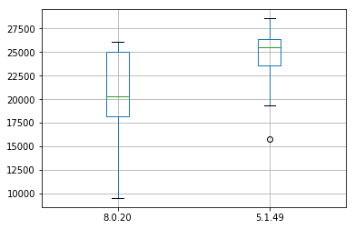

# wikibase-insert

In this experiment I tried to find a faster way to insert a huge amount of items into a Wikibase instance. I have not been able to insert more
than two or three statements per second using the 'official' tools, such as QuickStatements or the WDI library.

Therefore, I am inserting the data directly into the MySQL database used by Wikibase.

The process consists of these steps:

- generate the data for an item in JSON
- determine the next Q number and update the JSON item data accordingly
- insert data into the various database tables

However, if you do this without a transaction it is still terrible slow. In my setup only 120 items per minute. However, if I wrap the inserts into a transaction I was able to insert 33,000 items/minute.

## Steps to run the experiment

You need [Docker Compose](https://docs.docker.com/compose/).

- Start the containers: `docker-compose up` and wait until you see lines ending like:

```
[main] INFO  o.w.q.r.t.change.RecentChangesPoller - Got no real changes
[main] INFO  org.wikidata.query.rdf.tool.Updater - Sleeping for 10 secs
```

- Compile and run the Java program: `mvn compile exec:java`

For me it took a minute to insert 100 items without a transaction and 25 seconds to insert 10,000 items with a transction.

## MySQL JDBC driver

It seems that the MySQL JDBC driver has a significant influence on the performance. I have tried the old 5.1.49 and the new 8.0.20 version of the driver. I ran 10 experiments with each driver. This boxplot shows the number of inserted items per minute:


